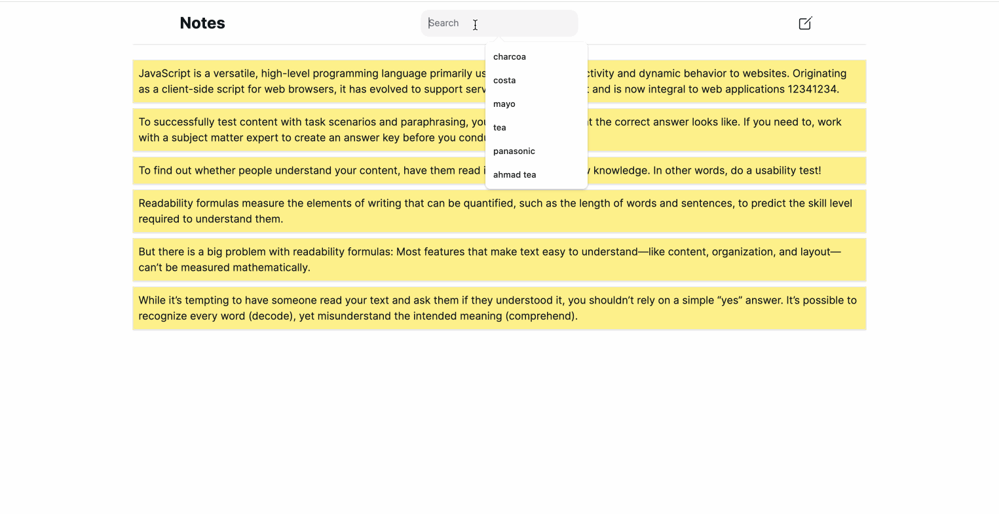

## Installation

First, make sure Node and npm are installed

### Node Packages

```
npm install
```

## Configuration

### Create .env file from .env.example

```
cp .env.example .env
```

### Database Integration

1. Open .env file
2. Create a database and connect it with Next.js by adjusting the `DATABASE_URL` with your own configuration

### Migrate the Database Migration

```
npx prisma db push
```

## Run App

```bash
npm run dev
# or
npm run build
npm start
```

Open [http://localhost:3000](http://localhost:3000) with your browser to see the result.

## Vercel deployment

Navigate [https://solace-notes-nine.vercel.app](https://solace-notes-nine.vercel.app) to see a hosted/deployed version.

## Project details

Notes project is using NextJS + NextUI + TailwindCSS + Zod(for validation) + react-icons + Prisma ORM configured for sqlite local DB. The Demo of UX usage is provided.


